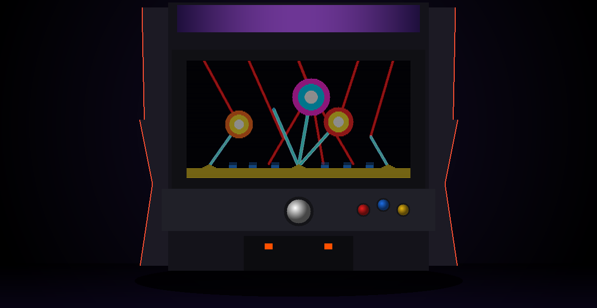

<div align="center">



# MISSILE COMMAND

### *Authentic 1980 Atari Arcade Replica in Go & Ebitengine*

[](https://golang.org)
[](https://github.com/scottdensmore/missile-command/actions)
[](https://github.com/scottdensmore/missile-command/releases)
[](LICENSE)
[]()

<br/>

**Defend six cities from an escalating nuclear barrage.**
A feature-complete, byte-for-byte authentic recreation of Dave Theurer's legendary 1980 Atari arcade masterpiece.

[Quick Start](#-quick-start) • [Controls](#-controls) • [Documentation](#-documentation) • [Releases](https://github.com/scottdensmore/missile-command/releases)

---

</div>

## 📖 Overview

Originally released in 1980 by Atari, Inc., **Missile Command** is one of the most intense and iconic titles of the Golden Age of Arcade Games. This project is a pure Go implementation powered by [Ebitengine](https://ebitengine.org/), designed to replicate every detail of the original arcade hardware: from the **Atari POKEY 4-channel discrete sound synthesis** to the **256×231 CRT raster display, wave color RAM tables, smart bomb evasion algorithms, and fast center silo mechanics**.

Zero external audio assets or sprite packs are required—every sound waveform and pixel graphic is synthesized and rendered dynamically in real time.

---

## 🚀 Quick Start

### 1. Download Precompiled Releases & Distribution Packages
Ready-to-run releases and distribution packages are available on the **[Releases Page](https://github.com/scottdensmore/missile-command/releases)**:
* 🍏 **macOS Universal Bundle**: `Missile-Command-macOS-Universal.zip` — Standalone double-clickable `Missile Command.app` containing a Universal 2 binary running natively on both Apple Silicon (M1/M2/M3/M4) and Intel Macs. Single-architecture CLI binaries (`arm64` & `amd64`) are also provided.
* 🪟 **Windows Setup Installer**: `Missile-Command-Setup-windows-amd64.exe` — Standalone Inno Setup wizard installer with Start Menu group, optional desktop shortcut, uninstaller registration, and non-elevated user-mode support.
* 📦 **Windows Portable Package**: `missile-command-windows-amd64.zip` — Ready-to-unzip archive with executable, desktop icon, and documentation (standalone `missile-command-windows-amd64.exe` also available).
* 🐧 **Linux Package**: `missile-command-linux-amd64.tar.gz` — Includes binary and Freedesktop icon set (standalone `missile-command-linux-amd64` also available).
* 🌐 **WebAssembly Web Port**: `missile-command-wasm.zip` — Ready-to-host web bundle with retro arcade HTML runner, WASM engine, and theme-aware favicons.
* 🔒 **Security**: `checksums.txt` — SHA-256 checksums for all distribution packages and binaries.

### 2. Run from Source
Prerequisites: [Go 1.25+](https://golang.org/dl/) installed.

```bash
# Clone the repository
git clone https://github.com/scottdensmore/missile-command.git
cd missile-command

# Run directly
go run .

# Or build the binary
go build -o missile-command .
./missile-command

# Or package a standalone macOS .app bundle
bash scripts/bundle-macos.sh
open "Missile Command.app"
```

> **Linux Users**: Ensure audio and OpenGL libraries are installed:
> ```bash
> sudo apt-get install -y libgl1-mesa-dev xorg-dev libasound2-dev
> ```

### 3. Application Icons & Multi-Platform Support
Missile Command features a custom, high-resolution application icon engineered to conform strictly to **Apple macOS Human Interface Guidelines (HIG)**:
* **macOS**: Native `assets/icon.icns` packaging with Retina densities (16×16 up to 1024×1024) inside an 824×824 continuous-curvature squircle grid, brushed titanium bezel, and dual-layer elevation shadow.
* **Light & Dark Mode**: Optimized for high contrast against both bright wallpapers and dark macOS Docks / theme bars.
* **Windows**: Multi-resolution `assets/icon.ico` (16, 32, 48, 64, 128, 256).
* **Linux**: Freedesktop icon assets in `assets/icons/icon-*.png`.
* **Web**: Theme-aware `web/favicon.ico`, `web/favicon-light.png`, and `web/favicon-dark.png` (`prefers-color-scheme`).
* **Desktop Runtime**: Multi-size icons decoded and registered dynamically at launch via `ebiten.SetWindowIcon()`.

---

## 🕹️ Controls

<div align="center">

| Action | Primary Input | Keyboard | Gamepad |
| :--- | :--- | :--- | :--- |
| **Start Game** | `Left Click` on Title Screen | `Space` / `1` / `Enter` | `Start` / `A` / `Cross` |
| **Aim Crosshair** | `Mouse Movement` | `Arrow Keys` | `Left Stick` / `D-Pad` |
| **Fire Left Base (Alpha)** | `Left Mouse Button` | `A` or `1` | `LB` / `LT` / `A` (Bottom action) |
| **Fire Center Base (Delta - Fast)** | `Middle Mouse Button` / `Space` | `S` or `2` | `X` / `Y` (Left/Top action) |
| **Fire Right Base (Omega)** | `Right Mouse Button` | `D` or `3` | `RB` / `RT` / `B` (Right action) |
| **Toggle CRT Scanlines** | **`F1` / `Tab`** | **`F1` / `Tab`** | — |
| **Toggle Fullscreen** | **`F11` / `Alt+Enter`** | **`F11` / `Alt+Enter`** | — |
| **Mute / Unmute** | **`M`** | **`M`** | — |
| **Adjust Volume** | **`-` / `+`** | **`-` / `+`** | — |
| **Pause / Resume** | **`P`** | **`P`** | `Start` |
| **Quit Game / Exit** | **`Q`** | **`Q`** | — |
| **Release Mouse Cursor** | **`Escape`** | **`Escape`** | — |

</div>

---

## 📚 Documentation

Explore the detailed technical documentation and game guides:

* 🔊 **[Atari POKEY Audio Synthesizer (`docs/audio.md`)](docs/audio.md)**
  Discrete 4-channel sound synthesis, polynomial noise LFSR algorithms (poly4, poly5, poly17), event sound effects, and continuous ambient tones.

* 📊 **[Attack Wave Guide & Color Palettes (`docs/wave-guide.md`)](docs/wave-guide.md)**
  Complete wave tables, scoring multipliers ($1\times$ to $6\times$), 10 cycling wave color RAM combinations, smart bomb evasion mechanics, and bonus city replenishment.

* 🎯 **[Controls & Strategic Firing Guide (`docs/controls.md`)](docs/controls.md)**
  Comprehensive firing mechanics, the strategic value of the fast Delta center silo ($7.5\times$ velocity), and ammunition conservation tactics.

* 🏛️ **[Technical Architecture & Pipeline (`docs/architecture.md`)](docs/architecture.md)**
  Software design, 256×231 native raster framebuffer pipeline, aspect-ratio letterboxing, Kage CRT scanline shaders, and game state machine.

* 📜 **[Changelog & Release Notes (`CHANGELOG.md`)](CHANGELOG.md)**
  Full version history and release notes.

---

## 🧪 Testing & CI/CD
 
Run the automated test suite locally:
```bash
go test -v ./...
```

The repository features two automated GitHub Actions workflows:
* 🛠️ **[CI Pipeline (`.github/workflows/ci.yml`)](.github/workflows/ci.yml)**: Runs unit tests across Linux (with virtual framebuffer `xvfb`), macOS, and Windows with race detection, verifies Go dependencies, and tests WebAssembly compilation on all pull requests and pushes to `main`.
* 🚀 **[Release Pipeline (`.github/workflows/release.yml`)](.github/workflows/release.yml)**: Automatically cuts and publishes multi-platform releases when features or bug fixes land on `main` (driven by `CHANGELOG.md` versioning and conventional commits), upon manual tag pushes (`v*`), or via manual `workflow_dispatch`. Builds and publishes macOS Universal `.app` bundles, Windows Setup wizard installers, Windows portable ZIPs, Linux Tarballs, WebAssembly web packages, standalone binaries, and SHA-256 checksums.

---

## 📜 Historical Note & License

*Missile Command* was created by **Dave Theurer** at Atari, Inc. in 1980. This project is dedicated to preserving the craftsmanship, audio engineering, and gameplay dynamics of the original arcade cabinet.

This project is open source and available under the [MIT License](LICENSE).
Missile Command is a registered trademark of Atari Interactive, Inc. This fan recreation is developed for educational and historical preservation purposes.
