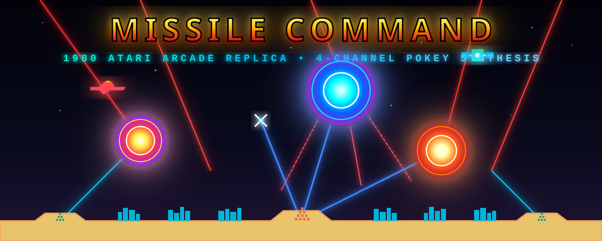

<div align="center">



# MISSILE COMMAND

### *Authentic 1980 Atari Arcade Replica in Go & Ebitengine*

[](https://golang.org)
[](https://github.com/scottdensmore/missile-command/actions)
[](https://github.com/scottdensmore/missile-command/releases)
[](LICENSE)
[]()

<br/>

**Defend six cities from an escalating nuclear onslaught.**
A feature-complete, byte-for-byte authentic recreation of Dave Theurer's legendary 1980 Atari arcade masterpiece.

[Play Now](#-quick-start) • [Controls](#-controls) • [Features](#-features) • [Wave Guide](#-wave-progression--color-palettes) • [Architecture](#-technical-architecture)

---

</div>

## 📖 Overview

Originally released in 1980 by Atari, Inc., **Missile Command** is one of the most intense and iconic video games of the Golden Age of Arcade Games. This project is a pure Go implementation powered by [Ebitengine](https://ebitengine.org/), designed to replicate every nuance of the original hardware: from the **Atari POKEY 4-channel discrete sound synthesis** to the **256×231 CRT raster display, wave color RAM tables, smart bomb evasion algorithms, and fast center silo mechanics**.

Zero external audio assets or sprite packages are required—every sound waveform and pixel graphic is synthesized and rendered dynamically in real time.

---

## ⚡ Key Features

### 🔊 1. Atari POKEY 4-Channel Audio Engine
* **Discrete Noise Synthesis**: Simulates the Atari POKEY (CO-12294) audio chip with 4-bit, 5-bit, and 17-bit polynomial LFSR noise generators alongside pure square-wave dividers.
* **8 Event Sound Effects**:
  * **ABM Launch**: Rocket whistle sweep down from 950 Hz to 160 Hz.
  * **Explosion**: Multi-stage crunchy low-frequency bass rumble.
  * **Tally Blips**: Crisp 1200 Hz electronic chirps during end-of-wave counting.
  * **Wave Start Siren**: 1.2-second dual-tone warble klaxon alert.
  * **Silo Low Warning**: Dual-tone 880 Hz / 440 Hz rapid alarm when a silo drops to $\le 3$ missiles.
  * **Can't Fire Buzzer**: Low 110 Hz warning buzz when clicking an empty or ruined base.
  * **Bonus City Fanfare**: Ascending 6-tone chime sequence when earning a bonus city every 10,000 points.
  * **"THE END" Blast**: 2.5-second apocalyptic nuclear detonation body.
* **3 Continuous Enemy Sounds**:
  * **Bomber Drone**: 62 Hz low motor thrum.
  * **Satellite Telemetry**: 1350 Hz pulsed high-orbit radar beeps.
  * **Smart Bomb Warble**: 220 Hz rhythmic pulsed buzzing while navigating.

---

### 🎨 2. Authentic Arcade Visuals & Dynamic Color Cycling
* **10 Wave Color Palettes**: Exact 2-wave cycling combinations (Black/Yellow, Black/Blue, Black/Red, Dark Blue/Yellow, Light Blue/Yellow, Purple/Green, Yellow/Green, White/Red, Red/Yellow).
* **Explosion Rainbow Cycling**: Simulates original arcade color lookup tables that pulse explosions through white, yellow, cyan, magenta, orange, green, and red.
* **Pixel-Perfect Sprites**: 8×8 arcade font, intact and destroyed city graphics, 3 base terrain mounds with 10-missile pyramids, `LOW` and `OUT` flashing status text, bomber aircraft, satellite, spinning smart bomb star, and bonus city reserve icons.
* **CRT Scanline & Letterbox Pipeline**: Internal 256×231 framebuffer with integer-scaled 4:3 letterboxing and CRT scanline/phosphor bloom shaders.

---

### 🚀 3. Gameplay Mechanics & Enemy AI
* **Fast Center Silo (Delta)**: The center battery fires counter-missiles at **7.5 units/frame** ($>2\times$ faster than side bases at 3.2 units/frame) for urgent last-second intercepts.
* **Smart Bombs (Wave 6+)**: Features real-time explosion avoidance steering AI—actively evades and maneuvers around expanding player explosion perimeters.
* **Fliers (Bombers & Satellites)**: Cross the upper atmosphere horizontally, dropping targeted munitions.
* **MIRV Splitters**: Multi-warhead ICBMs that split at mid-altitudes into multiple trajectories.
* **Scoring Multipliers**: Scales progressively from $1\times$ to $6\times$ (capping at wave 11) for kills, remaining ammo ($5 \times M$), and saved cities ($100 \times M$).
* **Bonus City System**: Stored bonus cities (awarded at every 10,000 points) automatically rebuild destroyed city slots at wave end with fanfare.
* **"THE END" Nuclear Climax**: Total city destruction triggers a screen-wide blinding flash, expanding nuclear fireball, giant `THE END` typography, and apocalyptic rumble.
* **High Score Leaderboard**: Interactive 3-letter initials entry screen for top 10 scores with persistent storage in `highscores.json`.

---

## 🕹️ Controls

<div align="center">

| Action | Primary Input | Keyboard Alternative |
| :--- | :--- | :--- |
| **Start Game** | `Left Click` on Title Screen | `Space` / `1` / `Enter` |
| **Aim Crosshair** | `Mouse Movement` (Trackball feel) | `Arrow Keys` |
| **Fire Left Base (Alpha)** | `Left Mouse Button` | `A` or `1` |
| **Fire Center Base (Delta - Fast)** | `Middle Mouse Button` / `Space` | `S` or `2` |
| **Fire Right Base (Omega)** | `Right Mouse Button` | `D` or `3` |
| **Pause / Resume** | **`P`** | **`P`** |
| **Quit Game / Exit** | **`Q`** | **`Q`** |
| **Release Mouse Cursor** | **`Escape`** | **`Escape`** |

</div>

---

## 🚀 Quick Start

### Prerequisites
* [Go](https://golang.org/dl/) **1.25** or later installed.
* On **Linux**, ensure audio and OpenGL development libraries are present:
  ```bash
  sudo apt-get install -y libgl1-mesa-dev xorg-dev libasound2-dev
  ```

### Running Locally
```bash
# Clone the repository
git clone https://github.com/scottdensmore/missile-command.git
cd missile-command

# Run directly
go run .

# Or build the binary
go build -o missile-command .
./missile-command
```

---

## 📊 Wave Progression & Color Palettes

The arcade progression table matches the original 1980 Atari ROM specifications:

| Waves | Sky Color | Ground Color | Multiplier | # ICBMs | # Smart Bombs | Flier Threat |
| :---: | :---: | :---: | :---: | :---: | :---: | :---: |
| **1–2** | Black | Yellow | **1X** | 12–15 | 0 | Low |
| **3–4** | Black | Blue | **2X** | 18–12 | 0 | Medium |
| **5–6** | Black | Red | **3X** | 16–14 | 1 | High |
| **7–8** | Black | Red | **4X** | 17–10 | 1–2 | High |
| **9–10** | Dark Blue | Yellow | **5X** | 13–16 | 3–4 | High |
| **11–12** | Light Blue | Yellow | **6X** | 19–12 | 4–5 | Extreme |
| **13–14** | Purple | Green | **6X** | 14–16 | 5–6 | Extreme |
| **15–16** | Yellow | Green | **6X** | 18–14 | 6–7 | Maximum |
| **17–18** | White | Red | **6X** | 17–19 | 7 | Maximum |
| **19–20** | Red | Yellow | **6X** | 22 | 7 | Maximum |

*(Starting with Wave 21, the 10 color combinations repeat indefinitely at maximum difficulty).*

---

## 🏛️ Technical Architecture

```
missile-command/
├── assets/
│   ├── banner.svg         # High-resolution vector arcade marquee banner
│   └── banner.png         # Raster banner asset
├── game/
│   ├── audio.go           # 4-channel POKEY sound synthesizer & LFSR noise
│   ├── font.go            # Vector font strokes
│   ├── game.go            # State machine, entity loop, collision & input
│   ├── game_test.go       # Comprehensive unit & simulation test suite
│   ├── math.go            # 256x231 simulation coordinates & letterbox math
│   ├── objects.go         # ICBMs, SmartBombs, Fliers, ABMs, Silos, Cities
│   ├── palette.go         # 10 wave color tables & explosion palette cycler
│   ├── pipeline.go        # Framebuffer scaler & CRT post-processing
│   ├── scores.go          # High score table, initials entry & persistence
│   ├── shader.go          # Kage CRT scanline shader with flash support
│   └── sprites.go         # 8x8 bitmap font, cities, bases, planes, satellites
├── .github/
│   └── workflows/
│       ├── ci.yml         # Multi-platform CI testing (macOS, Linux, Windows)
│       └── release.yml    # Automated release binary builds
├── CHANGELOG.md           # Version release notes
├── LICENSE                # MIT License
├── main.go                # Application entrypoint & window configuration
└── go.mod                 # Go module definitions
```

---

## 🧪 Testing

Run the automated test suite:
```bash
go test -v ./...
```

Tests cover:
* Wave progression parameters and $1\times$ to $6\times$ scoring multipliers.
* Center silo ($7.5\times$) vs side silo ($3.2\times$) launch velocity.
* Smart bomb dynamic explosion evasion math.
* Top 10 high score leaderboard sorting, truncation, and JSON persistence.
* Real-time POKEY audio buffer generation without clipping or distortion.
* Framebuffer rendering pipeline across all arcade states.

---

## 📜 Historical Note

*Missile Command* was created by **Dave Theurer** at Atari, Inc. in 1980 during the height of the Cold War. The game's frantic pacing, looming threat of mutual assured destruction, and iconic trackball control made it an enduring arcade classic. This project is dedicated to preserving the craftsmanship, audio engineering, and gameplay dynamics of the original arcade cabinet.

---

## 📄 License

This project is open source and available under the [MIT License](LICENSE).
Missile Command is a registered trademark of Atari Interactive, Inc. This fan recreation is developed for educational and historical preservation purposes.

