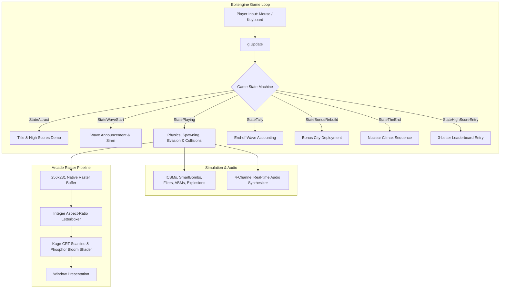
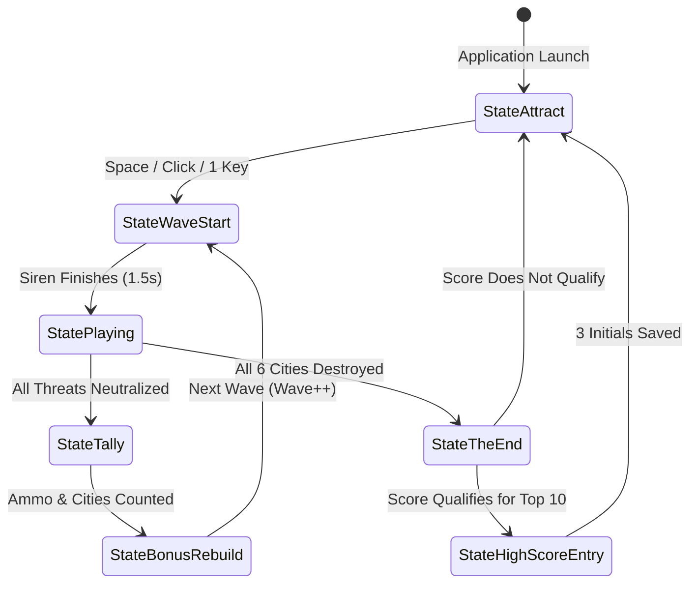

# Technical Architecture & Pipeline

This document describes the software architecture, rendering pipeline, and state machine of the *Missile Command* replica.

---

## High-Level Architecture

---

## Native 256×231 Raster Framebuffer Pipeline

The original arcade cabinet displayed graphics on a 256×231 cathode ray tube with dynamic color lookup RAM.

### 1. Framebuffer Isolation
All game primitives (lines, filled polygons, 8×8 bitmap text, and pixel sprites) are drawn directly onto an internal `256×231` `*ebiten.Image`.

### 2. Aspect-Ratio Letterboxer (`game/pipeline.go`)
When running on modern displays with arbitrary resolutions:
1. Calculates the maximum integer/float scale factor:
   $$\text{scale} = \min\left(\frac{W_{\text{window}}}{256}, \frac{H_{\text{window}}}{231}\right)$$
2. Centers the 4:3 playfield with letterbox/pillarbox margins.
3. Maps mouse cursor input from window pixels back to the $256 \times 231$ simulation coordinate space using [`ScreenToSimWithLetterbox`](../game/math.go).

### 3. Kage CRT Scanline Shader (`game/shader.go`)
The shader performs:
- Sinusoidal scanline modulation synchronized to the 231-line vertical raster:
  $$\text{scanline} = \sin(y \cdot 231 \cdot \pi) \cdot 0.08$$
- Color saturation boost mimicking aged CRT phosphor bleed.
- Dynamic screen flash intensity for nuclear detonations and city destruction.

---

## State Machine & Transitions

---

## Directory Structure

| File | Purpose |
| :--- | :--- |
| [`game/audio.go`](../game/audio.go) | Real-time POKEY 4-channel sound synthesizer and LFSR noise generators. |
| [`game/game.go`](../game/game.go) | Central game loop, state transitions, entity updates, and HUD rendering. |
| [`game/objects.go`](../game/objects.go) | Data structures for ICBMs, SmartBombs, Fliers, ABMs, Explosions, Cities, and Silos. |
| [`game/palette.go`](../game/palette.go) | 10 wave color RAM combinations and dynamic explosion color-cycling tables. |
| [`game/sprites.go`](../game/sprites.go) | 8×8 arcade bitmap font, city sprites, aircraft, satellites, and ammo pyramids. |
| [`game/pipeline.go`](../game/pipeline.go) | Aspect-ratio letterbox scaler and CRT shader compositing. |
| [`game/scores.go`](../game/scores.go) | Top 10 leaderboard management, JSON persistence, and initials entry. |
| [`game/shader.go`](../game/shader.go) | Kage GLSL-style CRT scanline and phosphor bloom fragment shader. |
| [`game/math.go`](../game/math.go) | Simulation geometry, vector distances, and coordinate transformation math. |

