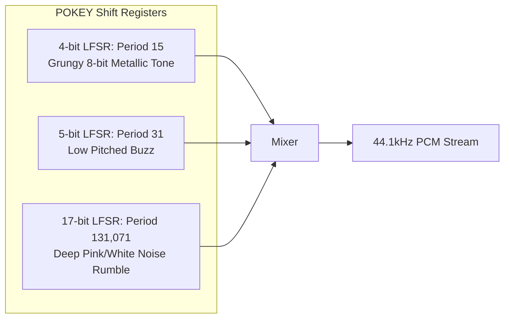

# Atari POKEY Audio Synthesizer

This document details the audio architecture and sound synthesis routines implemented in [`game/audio.go`](../game/audio.go).

---

## Overview

The original 1980 arcade version of *Missile Command* generated its soundscape using an Atari **POKEY** (Potentiometer / Keyboard) integrated circuit (part number **CO-12294**). The chip provides **4 independent audio channels**, each with:
- 8-bit frequency divider registers (`AUDF0`–`AUDF3`).
- 8-bit audio control registers (`AUDC0`–`AUDC3`) selecting distortion modes (polynomial noise generators) and 4-bit output volume.
- Master clock dividers (64 kHz / 15 kHz) and filter options (`AUDCTL`).

This project simulates the POKEY hardware at a standard **44,100 Hz** sample rate in pure Go with zero external audio assets.

---

## Linear Feedback Shift Register (LFSR) Noise Algorithms

The signature gritty, metallic, and rumbling textures of Atari arcade sound effects are produced by three polynomial noise shift registers:

### 1. 17-Bit Polynomial (Deep Explosion Noise)
- **Polynomial**: $x^{17} + x^{14} + 1$ (Period: 131,071 states)
- Used for deep explosion rumbles, sub-bass detonations, and the apocalyptic "THE END" nuclear climax.

### 2. 5-Bit & 4-Bit Polynomials (Gritty Distortion)
- **5-bit Polynomial**: $x^5 + x^3 + 1$ (Period: 31 states)
- **4-bit Polynomial**: $x^4 + x^3 + 1$ (Period: 15 states)
- Combined to create the engine thrum of bomber aircraft and the buzzy alert warnings.

---

## Event Sound Effects

| Effect | Characteristics & Synthesis Method | Duration |
| :--- | :--- | :---: |
| **ABM Rocket Launch** | Pure square-wave sweep starting at 950 Hz exponentially descending to 160 Hz with a terminal volume fade. | 0.28s |
| **Explosion Rumble** | 17-bit + 5/4-bit poly noise sampled through a 14× sample-and-hold divider with sharp attack and exponential volume decay. | 0.85s |
| **Bonus Tally Chirp** | Crisp 1200 Hz square wave pulse played per remaining missile and surviving city counted. | 35ms |
| **Wave Start Klaxon** | Dual-tone warbling siren alert oscillating between 480 Hz and 720 Hz at a 5 Hz LFO rate. | 1.20s |
| **Silo Low Alarm** | Rapid dual-tone warning (880 Hz followed by 440 Hz) triggered when a silo reaches $\le 3$ missiles. | 90ms |
| **Can't Fire Buzzer** | Low 110 Hz buzzy square wave combined with 4-bit poly distortion when clicking an empty or ruined base. | 120ms |
| **Bonus City Fanfare** | Ascending 6-tone chime sequence ($C_5, E_5, G_5, C_6, E_6, G_6$) played when earning a bonus city every 10,000 points. | 0.54s |
| **"THE END" Nuclear Blast** | Multi-channel deep sub-bass rumble sweeping down to 25 Hz with high-gain 17-bit poly noise. | 2.50s |

---

## Continuous Ambient Sounds

The original arcade hardware dedicated channels for continuous audio when enemy aircraft or smart weapons entered the playfield:

1. **Bomber Aircraft Drone**: 62 Hz rhythmic motor thrum with subtle second-harmonic modulation.
2. **Satellite Telemetry**: 1350 Hz high-pitch radar pulse modulated at 8 Hz.
3. **Smart Bomb Warble**: 220 Hz pulsing buzz modulated at 12 Hz that tracks evasive maneuvers.

### Channel Priority & Interruption Rules
High-priority audio alerts (such as the *Silo Low* warning or *Can't Fire* buzzer) take precedence over continuous ambient tones, momentarily pausing them and resuming smoothly upon completion.
